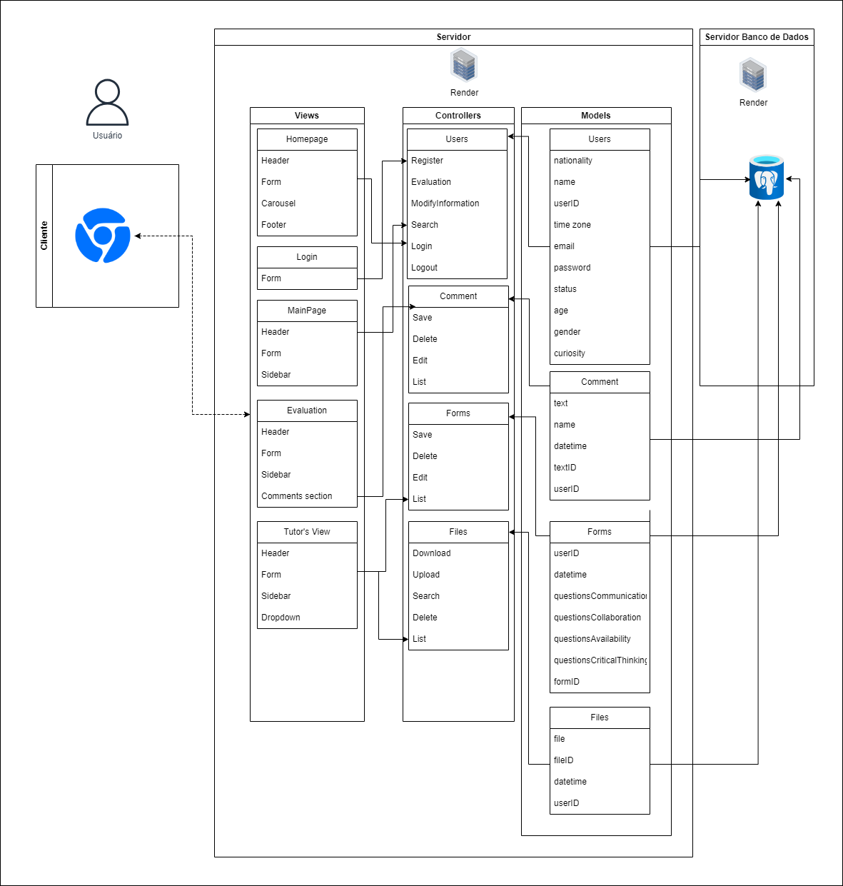

# Exemplo de Design de Arquitetura

</a>Figura 01 - Arquitetura da solução com padrão MVC
 

 

 

# Template Readme para Arquitetura MVC em Markdown
- Nome do Projeto: TechFlex
- Descrição: O objetivo do projeto é realizar uma aplicação web que auxilie no processo da simulação de negócios internacional CESIM Global Challenge. A competição tem como principal empecilho os problemas acarretados pela dificuldade de integração entre diferentes culturas, que acarreta em dificuldades de colaboração e comunicação.
- Arquitetura: MVC (Model-View-Controller)
- Ferramenta de Diagramação: draw.io

### Modelos (Models):
*Users:* Relacionado ao gerenciamento das informações pessoais dos usuários 
*Comment:* Relacionado ao gerenciamento dos comentários 
*Forms:* Relacionado ao gerenciamento das respostas dos formulários 
*Files:* Relacionado ao gerenciamento dos arquivos 
- Users  
*nationality*: A nacionalidade do usuário.  
*name*: O nome completo do usuário.  
*userID*: Um identificador único para cada usuário.  
*timezone*: O fuso horário do usuário.  
*email*: O endereço de e-mail do usuário.  
*password*: A senha do usuário.  
*status*: O status do usuário.  
*age*: A idade do usuário.  
*gender*: O gênero do usuário.  
*curiosity*: Informações ou fatos curiosos sobre o usuário.  

- Comment  
*text*: O conteúdo do comentário.  
*name*: Nome do usuário que postou o comentário.  
*datetime*: Data e hora em que o comentário foi postado.  
*textID*: Um identificador único para cada comentário.  
*userID*: Um identificador único para cada usuário.  

- Forms  
*formID*: Um identificador único para cada formulário.  
*datetime*: Data e hora em que o formulário foi preenchido.  
*questionsCommunication*: Respostas relacionadas a questões de comunicação.  
*questionsCollaboration*: Respostas relacionadas a questões de colaboração.  
*questionsAvailability*: Respostas relacionadas a questões de disponibilidade.  
*questionsCriticalThinking*: Respostas relacionadas a questões de pensamento crítico.  
*userID*: Um identificador único para cada usuário.  

- Files  
*file*: O arquivo que será carregado ou baixado.  
*fileID*: Um identificador único para cada arquivo.  
*datetime*: Data e hora em que o arquivo foi carregado.  
*userID*: Um identificador único para cada usuário.  

 

&nbsp;&nbsp;&nbsp;&nbsp;A entidade users se relaciona com todas as outras pelo fato de que em forms, comment e files, é necessário o userID, o identificador do usuário, para registrar as ações realizadas por cada usuário

### Controladores (Controllers):
*Users*: Gerencia ações relacionadas aos usuários, como Cadastro, Avaliação, Modificação de Informações, Busca, Login e Logout.
 
*Comment*: Controla a lógica para Gravar, Deletar, Editar e Listar comentários.
 
*Forms*: Gerencia a gravação, exclusão, edição e listagem dos dados dos formulários.
 
*Files*: Relacionado às operações de Baixar, Carregar, Buscar, Exclusão e Listagem de arquivos.

- Users Controller: 
Register: Cadastra informações de um novo usuário. 
Parâmetros de entrada: (nationality, name, email, password). 
ModifyInformation: Atualiza as informações de um usuário existente. 
Parâmetros de entrada: (id, name, timezone, email, password, status, age, gender, curiosity). 
Search: Busca usuários baseados em nome ou nacionalidade. 
Parâmetros de entrada: (name, nationality). 
Login: Autentica um usuário. 
Parâmetros de entrada: (email, password) 
Logout: Encerra a sessão de um usuário autenticado. 
Parâmetros de entrada: (userID). 

- Comment Controller: 
Save: Salva um novo comentário. 
Parâmetros de entrada: (text, datetime) 
Delete: Remove um comentário. 
Edit: Atualiza um comentário existente. 
Parâmetros de entrada: (id, text). 
List: Lista todos os comentários. 
Parâmetros de entrada: Nenhum. 
Saída: Lista de todos os comentários. 

- Forms Controller: 
Save: Salva respostas de um formulário. 
Parâmetros de entrada: questionsCommunication, questionsCollaboration, questionsAvailability, questionsCriticalThinking 
Delete: Exclui um formulário com base no ID. 
Parâmetros de entrada: formID. 
List: Lista todos os formulários preenchidos. 
Parâmetros de entrada: Nenhum. 
Saída: Lista de formulários preenchidos. 

- Files Controller: 
Upload: Carrega um novo arquivo. 
Parâmetros de entrada: file. 
Download: Inicia o download de um arquivo com base no ID. 
Parâmetros de entrada: fileID. 
Delete: Remove um arquivo com base no ID. 
Parâmetros de entrada: fileID. 
Search: Busca usuários baseados arquivo ou usuário. 
Parâmetros de entrada: (fileID, name). 
List: Lista todos os documentos. 
Parâmetros de entrada: Nenhum. 
Saída: Lista de documentos carregados. 

- Interação entre controllers com models e views: Os controllers são os responsáveis pela troca de informações do views com o models, de modo que quando o usuário interage com a View, como um preenchimento de um formulário, essa informação é enviada para o controller, este interpreta a ação e envia para o model. O model executa a lógica de negócios e acessa o banco de dados, podendo enviar ou consulturar informações do banco. Após isso, com os dados recebidos do model, o controller encaminha os dados para a view e assim o usuário recebe uma resposta visual.

### Views (Views):
*Homepage*: Apresenta a página inicial com *Header*, *Form*, *Carousel* e *Footer*.
 
*Login*: Contém o *Form* para que os usuários façam login.
 
*MainPage*: Mostra a página principal, após o login, com *Header*, *Form* e *Sidebar*.
 
*Evaluation*: Exibe a página de avaliações com *Header*, *Form*, *Sidebar* e *Comments section*.
 
*Tutor's View*: Oferece uma visão específica para tutores com *Header*, *Form*, *Sidebar* e *Dropdown* para opções adicionais.

- *Header*: É a parte superior da página, que contém a logo, o menu de navegação principal e outros elementos importantes.
- *Sidebar*: Uma área na lateral superior da página que quando o usuário clicar pode ter acesso à links que levam a outras telas do site.
- *Footer*: A parte inferior da página, em que haverão links de redirecionamento para outras telas da aplicação web e créditos.
- *Form*: Áreas onde os usuários podem inserir dados, como formulários de inscrição, formulários de contato, clicar em botões de interação, etc.
- *Carousel*: Elementos de interface de usuário que permitem que o conteúdo, como imagens, seja exibido em uma sequência de slides.
- *Comments section*: Uma área interativa na página onde os usuários podem postar comentários ou feedbacks.
- *Dropdown*: Um elemento de interface que permite aos usuários escolher uma opção de uma lista pré-definida. É útil para economizar espaço na tela, pois as opções ficam ocultas até que o usuário interaja com o componente.

### Infraestrutura:

A arquitetura é sustentada por servidores web que hospedam a aplicação MVC e servidores de banco de dados que armazenam as informações dos Models. Os servidores web executam a lógica dos Controllers e renderizam as Views, enquanto os servidores de banco de dados são responsáveis por guardar e gerenciar os dados dos Models. Além disso, é utilizado o Sails.js para implementar o padrão de projeto MVC no desenvolvimento do projeto.

### Justifique as escolhas feitas e como elas impactam o projeto.
#### Implicações da Arquitetura:
A escolha do MVC se dá pela separação clara de componentes, de front-end e back-end, o que facilita a manutenção e a expansão do sistema, pois é uma estrutura organizada que possibilita que diversos desenvolvedores trabalhem simultaneamente em diferentes funções. Os Controllers agem como intermediários entre Views e Models, o que aumenta a modularidade e facilita testes individuais de componentes. A infraestrutura suporta escalabilidade, dado que a lógica de negócios e a interface do usuário podem ser escaladas de maneira independente.

### Recursos Adicionais:
- Documentação do Sails.js: https://github.com/balderdashy/sails
- Tutorial do draw.io: https://m.youtube.com/watch?v=w3zm-wbmlpc
- Exemplos de diagramas MVC: https://www.lucidchart.com/pages/templates

